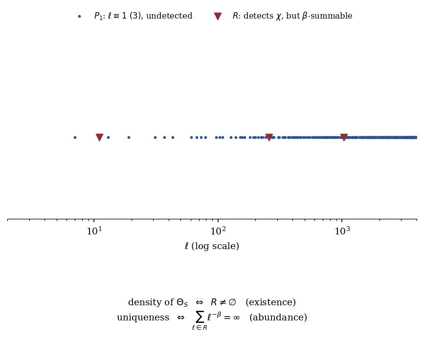
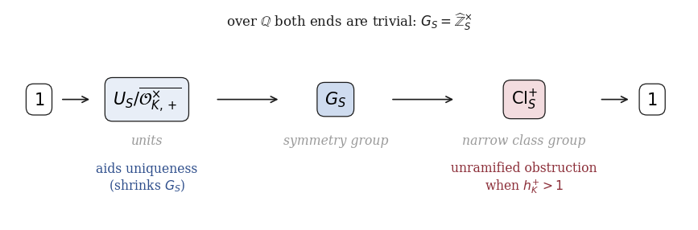
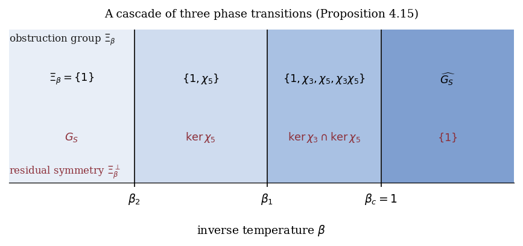
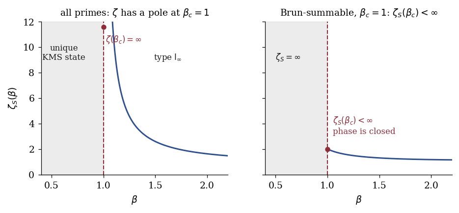

# Localized Bost–Connes systems: KMS uniqueness, Chebotarev density, and sparse prime sets

**Ruqing Chen** · GUT Geoservice Inc., Montreal · ruqing@hotmail.com

[](https://doi.org/10.5281/zenodo.22152101)

A complete classification of the KMS states of the $S$-local Bost–Connes system
$\mathcal{A}_{K,S}$, for an arbitrary number field $K$, an arbitrary set $S$ of
finite primes, and every inverse temperature $\beta > 0$.

> **Status: unrefereed preprint.** This work has not been peer reviewed and no
> priority check against the literature has been completed. See
> [Caveats](#caveats) before relying on anything here.

---

## The result in one line

The KMS$_\beta$ simplex of $\mathcal{A}_{K,S}$ is affinely isomorphic to
$\mathrm{Prob}\big(G_S/\Xi_\beta^\perp\big)$, where

$$\Xi_\beta(K,S)=\Big\\{\chi\in\widehat{G_S}\ :\ \sum_{\mathfrak{p}\in S} N\mathfrak{p}^{-\beta}\big|1-\chi(\mathrm{Frob}_\mathfrak{p})\big|^2<\infty\Big\\}.$$

Uniqueness holds exactly when $\Xi_\beta$ is trivial, i.e. when for every
nontrivial finite abelian $L/K$ unramified outside $S\cup\infty$, the primes of
$S$ that do **not** split completely in $L$ have divergent $\beta$-weighted sum.

For $S$ = all primes this is the Chebotarev density theorem, and the classical
theorems of Bost–Connes and Laca–Larsen–Neshveyev drop out. For sparse $S$ it
can fail — and the repository contains explicit failures.

## What is new here

**1. Divergence of the partition function does not imply uniqueness.**
It is natural to expect that when $\zeta_{K,S}(\beta)=\infty$ — no Gibbs states,
units of measure zero — the KMS state is forced. It is not. The correct
condition is not divergence but *equidistribution*, in the quantitative form
above.

**2. Topological density is not enough either.**
Density of the parameter subgroup $\Theta_S\le G_S$ is necessary but not
sufficient. For $S=\\{3\\}\cup\\{\ell\equiv1\ (3)\\}\cup R$ with $R$ sparse,
$\Theta_S$ is dense, $\zeta_S(\beta)=\infty$, and yet the KMS$_\beta$ simplex is
a **segment** at every $\beta>0$. The two extreme points are separated by an
explicit *pointwise* invariant

$$\Psi(x)=\Big(\tfrac{u_3(x)}{3}\Big)\cdot(-1)^{\sum_{\ell\in R}v_\ell(x)},$$

whose almost-everywhere definedness is exactly a Borel–Cantelli condition,
$\sum_{\ell\in R}\ell^{-\beta}<\infty$, while density needs only $R\neq\emptyset$.
Density asks for the *existence* of a detecting prime; uniqueness asks for their
*abundance*. The underlying dichotomy is Kakutani's.



**3. An unramified obstruction that cannot exist over $\mathbb{Q}$.**
The symmetry group sits in an exact sequence

$$1\to U_S/\overline{\mathcal{O}^\times_{K,+}}\to G_S\to \mathrm{Cl}^+_S\to 1$$

whose two ends are invisible over $\mathbb{Q}$. When $h^+_K>1$ the narrow
Hilbert class field supplies obstructing characters that are **unramified
everywhere** — over $\mathbb{Q}$ every obstruction needs a modulus supported on
$S$, hence ramification. Realized explicitly over $\mathbb{Q}(\sqrt{-5})$.
The unit group pushes the other way: enlarging $\overline{\mathcal{O}^\times_{K,+}}$
shrinks $G_S$ and makes uniqueness *easier*.



**4. Cascades of phase transitions.**
$\beta\mapsto\Xi_\beta$ is non-decreasing, so the phase diagram is a chain of
subgroups. Any prescribed finite number of transitions can be realized. The
classical systems have exactly one.



**5. Sparse sets have a closed low-temperature phase.**
For Brun-summable $S$ with critical exponent 1, the partition function is
*finite at the critical point*, so the type $\mathrm{I}_\infty$ phase is the
closed half-line $[\beta_c,\infty)$. This is the opposite of Bost–Connes, where
$\beta_c=1$ sits in the high-temperature phase. Same critical temperature,
opposite behaviour at it; the distinction is Mertens' theorem versus Brun's.



For $S=\\{2\\}\cup\mathcal{SG}$ with $\mathcal{SG}$ the Sophie Germain primes:
$\beta_c\le1$ unconditionally (Brun–Halberstam–Richert), $\beta_c=1$ under a
Hardy–Littlewood-type lower bound, and the *existence* of a transition is
equivalent to $\mathcal{SG}$ having positive convergence exponent.

> This last point is a **dictionary entry, not a method**. The operator-algebraic
> statement is equivalent to the arithmetic one and the equivalence runs in the
> unhelpful direction; it yields nothing new about Sophie Germain primes. The
> paper says so explicitly (Remark 5.7).

---

## Repository layout

```
arxiv/      submission metadata: abstract, comments, MSC codes, pre-posting checklist
paper/      LaTeX source and compiled PDF of the manuscript
code/       verification suite and figure generation
  bcloc/    small library: characters, prime sets, the criterion, Psi
data/       machine-readable evidence produced by the verification suite
figures/    PDF (for LaTeX) and PNG (for this README)
docs/       proof dependency map and a summary of what is / is not established
```

## Reproducing everything

Requires Python ≥ 3.10 with `numpy` and `matplotlib`, and a TeX distribution
with `amsart`.

```bash
make all          # verify, figures, paper
# or individually:
make verify       # run the nine numerical checks
make figures      # regenerate figures/
make paper        # compile paper/master_bost_connes_paper.pdf
```

Or directly:

```bash
cd code
python3 verify_claims.py            # add --quick for smaller bounds
python3 make_figures.py
cd ../paper && pdflatex master_bost_connes_paper.tex   # ×3 for the ToC
```

### What the verification suite checks

Nine claims, all currently passing. These are **finite verifications**: they can
refute a claim but never prove one. The proofs are in the manuscript; this code
exists to catch slips.

| Check | Paper reference |
|---|---|
| The identity for $1-\|m_\mathfrak{p}\|^2$ | Lemma 3.2 |
| Admissible classes generate $(\mathbb{Z}/M)^\times$ | Lemma 5.6 |
| Pointwise invariance of $\Psi$ (+ necessity of its correction term) | Prop. 4.12(2) |
| Genus theory for $\mathbb{Q}(\sqrt{-5})$ | Example 4.2 |
| $(\mathbb{Z}/15)^\times/\langle 4\rangle\cong(\mathbb{Z}/2)^2$, quartic character excluded | Prop. 4.15 |
| Detecting sets on the cascade set are exactly $R_1,R_2,R_1\cup R_2$ | Prop. 4.15 |
| Sophie Germain primes lie in admissible classes | Thm. 5.5, Lemma 5.6 |
| Empty detecting set for $S=\\{3\\}\cup\\{\ell\equiv1\,(3)\\}$ | Example 3.13 |
| Detecting set is exactly the sparse part $R$ | Thm. 4.10 |

---

## Caveats

Read these before citing or building on this.

**Not peer reviewed.** No referee has seen this.

**Priority not verified.** The general form of the classification — in
particular the obstruction group $\Xi_\beta$ for arbitrary $S$ — may already be
implicit in the groupoid framework of Neshveyev's work on KMS states of
non-principal groupoids. A priority check against the literature is required
before publication. This is the single largest risk in the manuscript, and it is
a risk of attribution rather than of correctness.

**References written from memory.** Every bibliography entry was written without access to
the sources. Verification is tracked in [`docs/BIBLIOGRAPHY_CHECK.md`](docs/BIBLIOGRAPHY_CHECK.md):
**5 of 31** distinct entries are now verified; the 10 load-bearing ones still outstanding
are listed there in priority order, headed by Neshveyev (2013) and Laca (2000), on which
Prop. 2.8 of the master paper rests. Note also that several citations point at a *numbered
result inside* a source ("Thm. 1.3", "§3", "§5.3", "Ch. VII"); correct volume and pages do
not confirm those — they require reading the source, not looking it up.

**Conditional results are marked as such.** Theorem 5.5(2),(3),(5) depend on a
lower bound for $\pi_{\mathcal{SG}}$ of Hardy–Littlewood strength.
Remark 4.18 notes that the description of $G_S$ as a topological group, though
not the criterion itself, is entangled with Leopoldt's conjecture.

**Nothing here proves anything about prime distribution.** See point 5 above.

**On the ergodic theory.** That a minimal action need not be uniquely ergodic is
classical (Furstenberg); no novelty is claimed for the principle. What is new is
that the exact separation point can be written down and is a Dirichlet series
condition.

## Conventions

The Artin map is normalized **arithmetically**: a uniformizer at $\mathfrak{p}$,
as an idele trivial elsewhere, maps to the arithmetic Frobenius. The appearance
of the **narrow** class group is not a convention — it is forced by
$\mathbb{A}_{K,f}^\times/\overline{K^\times_+}\cong\mathrm{Gal}(K^{ab}/K)$
(Lemma 2.2); using the wide class group would give a proper quotient of the
correct symmetry group, halving it already for $K=\mathbb{Q}$.

## License

Code: MIT (see `LICENSE`). Manuscript text and figures: CC BY 4.0 (see
`LICENSE-CC-BY`).
